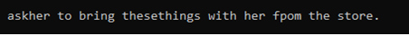

## Table of contents
* [General info](#general-info)
* [Technologies](#technologies)
* [Setup](#setup)

## General info
### Speech-to-Text-WaveNet : End-to-end sentence level English
The architecture is shown in the following figure.
<p align="center">
  
</p>
This image is cropped from [WaveNet: A Generative Model for Raw Audio](https://arxiv.org/abs/1609.03499).


<table style="border-collapse: collapse">
<tr>
<td>
<p>
The WaveNet neural network architecture directly generates a raw audio waveform,
showing excellent results in text-to-speech and general audio generation.
</p>
<p>
The network models the conditional probability to generate the next
sample in the audio waveform, given all previous samples and possibly
additional parameters.
</p>
<p>
After an audio preprocessing step, the input waveform is quantized to a fixed integer range.
The integer amplitudes are then one-hot encoded to produce a tensor of shape <code>(num_samples, num_channels)</code>.
</p>
<p>
A convolutional layer that only accesses the current and previous inputs then reduces the channel dimension.
</p>
<p>
The core of the network is constructed as a stack of causal dilated layers, each of which is a
dilated convolution (convolution with holes), which only accesses the current and past audio samples.
</p>
<p>
The outputs of all layers are combined and extended back to the original number
of channels by a series of dense postprocessing layers, followed by a softmax
function to transform the outputs into a categorical distribution.
</p>
<p>
The loss function is the cross-entropy between the output for each timestep and the input at the next timestep.
</p>
<p>
In this repository, the network implementation can be found in <a href="./wavenet.py ">wavenet.py</a>.
</p>
</td>
<!-- <td width="300">
</img>
</td> -->
</tr>
</table>
	
## Technologies

TensorFlow needs to be installed before running the training script.
Code is tested on TensorFlow version 2 for Python 3.10

In addition, [glog](https://github.com/benley/python-glog.git) and [librosa](https://github.com/librosa/librosa) must be installed for reading and writing audio.

To install the required python packages, run
```bash
pip install -r requirements.txt
```

## Setup
To run this project, install it locally.

### Dataset

You can use any corpus containing `.wav` files.

- We've mainly used the [VCTK](http://homepages.inf.ed.ac.uk/jyamagis/page3/page58/page58.html) (around 10.4GB, [Alternative host](http://www.udialogue.org/download/cstr-vctk-corpus.html)) so far.
- [LibriSpeech](http://www.openslr.org/12/)
- [TEDLIUM release 2](http://www-lium.univ-lemans.fr/en/content/ted-lium-corpus)

### Usage
**Create dataset**

1. Download and extract dataset(only VCTK support)
2. Assume the directory of VCTK dataset is C:/speech_to_text, Execute to create record for train or test
```
python tools/create_tf_record.py -input_dir='C:/speech_to_text'
```

Execute to train model.
```
python train.py
```

Execute to evalute model.
```
python test.py
```

**Demo**

1.Download pretrain model <a href="./trained_models"> Best model </a> and extract to 'release' directory

2.Execute to transform a speech wave file to the English sentence. The result will be printed on the console. 
```
python demo.py -input_path <wave_file path>
```

For example, try the following command.
```
python demo.py -input_path=data/demo.wav -ckpt_model=release/<name of the modele>
```

**Results**

After the demo with a WAV file, the result of the sentence
```
Ask her to bring these things with her from the store" 
```
is given in the figure below :

<td>
</img>
</td>


**Citation**

```
Ibab. tensorflow-wavenet 2016. GitHub repository. https://github.com/ibab/tensorflow-wavenet/.
```
