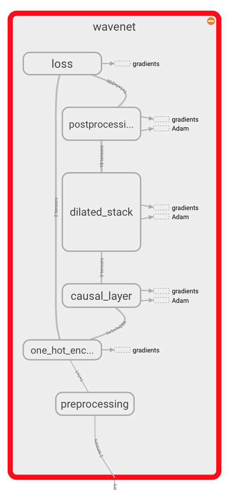

# A TensorFlow implementation of DeepMind's WaveNet paper 

This is a TensorFlow implementation of the [WaveNet generative neural
network architecture](https://deepmind.com/blog/wavenet-generative-model-raw-audio/) for audio generation.


<table style="border-collapse: collapse">
<tr>
<td>
<p>
The WaveNet neural network architecture directly generates a raw audio waveform,
showing excellent results in text-to-speech and general audio generation (see the
DeepMind blog post and paper for details).
</p>
<p>
The network models the conditional probability to generate the next
sample in the audio waveform, given all previous samples and possibly
additional parameters.
</p>
<p>
After an audio preprocessing step, the input waveform is quantized to a fixed integer range.
The integer amplitudes are then one-hot encoded to produce a tensor of shape <code>(num_samples, num_channels)</code>.
</p>
<p>
A convolutional layer that only accesses the current and previous inputs then reduces the channel dimension.
</p>
<p>
The core of the network is constructed as a stack of <em>causal dilated layers</em>, each of which is a
dilated convolution (convolution with holes), which only accesses the current and past audio samples.
</p>
<p>
The outputs of all layers are combined and extended back to the original number
of channels by a series of dense postprocessing layers, followed by a softmax
function to transform the outputs into a categorical distribution.
</p>
<p>
The loss function is the cross-entropy between the output for each timestep and the input at the next timestep.
</p>
<p>
In this repository, the network implementation can be found in <a href="./wavenet/model.py">model.py</a>.
</p>
</td>
<td width="300">
</img>
</td>
</tr>
</table>


## Requirements

TensorFlow needs to be installed before running the training script.
Code is tested on TensorFlow version 2 for Python 3.9.

In addition, [librosa](https://github.com/librosa/librosa) must be installed for reading and writing audio.

To install the required python packages, run
```bash
pip install -r requirements.txt
```

For GPU support, use
```bash
pip install -r requirements_gpu.txt
```
## Training the network

You can use any corpus containing `.wav` files.
We've mainly used the [VCTK corpus](http://homepages.inf.ed.ac.uk/jyamagis/page3/page58/page58.html) (around 10.4GB, [Alternative host](http://www.udialogue.org/download/cstr-vctk-corpus.html)) so far.

In order to train the network, execute
```bash
python train.py --data_dir=corpus
```
to train the network, where `corpus` is a directory containing `.wav` files.
The script will recursively collect all `.wav` files in the directory.

You can see documentation on each of the training settings by running
```bash
python train.py --help
```